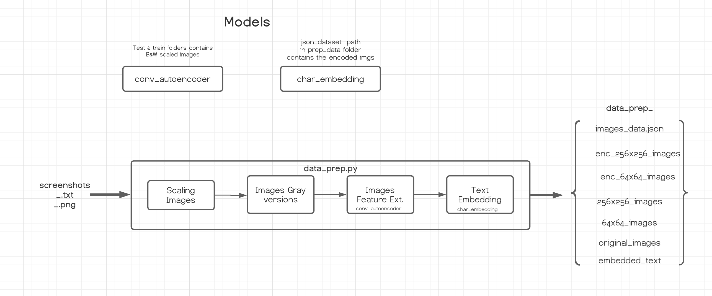

# CharCnnRnn Text Embedding 
A data processing pipeline (data_prep.py) that takes screenshots, and description text files to 
generate the text embedding tensors 
using pre-trained models, ConvAutoencoder for image feature extraction and CharCnnRnn
used to create the text embedding. Both models included and can be trained on a custom dataset. 
The generated output text embedding tensors' files will be used as [stackGAN](https://github.com/hanzhanggit/StackGAN) inputs. 

